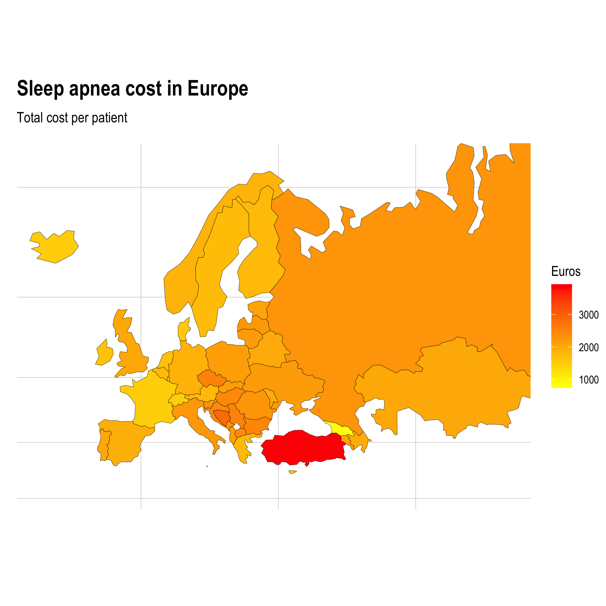

# Sleep Revolution - estimating cost of sleep apnea

THIS PROJECT ESTIMATES SLEEP APNEA COSTS IN EUROPE. DATA IS PUBLICLY AVAILABLE AT <http://ghdx.healthdata.org/> BY CC BY-NC-ND 4.0 LICENCE. RESULTS CAN BE REPLICATED BY THIS PROJECT.

Sleep apnea costs can be estimated by method shown in  *[Armeni et al. (2019) Cost-of-illness study of Obstructive Sleep Apnea Syndrome (OSAS) in Italy](https://cergas.unibocconi.eu/sites/default/files/files/Cost-of-illness-study-of-Obstructive-Sleep-Apnea-Syndrome-%2528OSAS%2529-in-Italy_Report%25281%2529.pdf)*. This project strongly utilizes the method article presents with open data science methods.

 

- **Direct costs** include hospitalizations, consultations, laboratory testing, drug or medical device consumption, etc.
- **Direct non healthcare costs** include transportation costs and informal care (i.e. care provided by family)
- **Productivity costs** include losses related to illness or death, patients and informal care time off work

## Project documentation 

For replicating the results/documentation, start with the project **[documentation](https://research.janimiettinen.fi/material/sleep22/index.html)** and fork your own project following the set of `.Rmd` files starting by `01-flatfiles.Rmd`. You can run, render & replicate the whole project by `run.R` file.

* [Project homepage](https://research.janimiettinen.fi/material/sleep22/index.html)

* [Github](https://github.com/janikmiet/sleep22)

Shiny applications related to the sleep apnea costs are in separated repositories. Applications data is generated in this project.

### Costs Visualization

Working ShinyApp can be found [here](https://janimiettinen.shinyapps.io/sleepapneacost/)

### Top-down Calculator

Working ShinyApp can be found [here](https://janimiettinen.shinyapps.io/sleepapneacalculator/)

 
Data: 

[Source](http://ghdx.healthdata.org) CC BY-NC-ND 4.0 LICENCE.

 
Project:
 
Copyright 2022 Jani Miettinen
 
License: CC BY-NC-ND